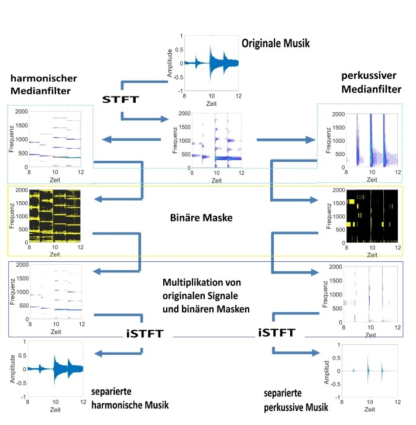
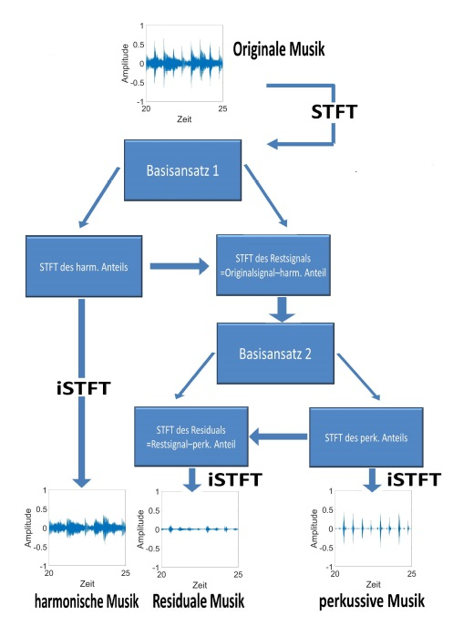

# Separation-of-the-harmonic-and-percussive-parts-of-polyphonic-music-signals

## Method A

The polyphonic music dealt with in this work consists of mostly different ones and extensive signal components. The separation of these harmonic and percussive signals from the overall polyphonic music with these properties using the fourier Transforamtion and different filters is the main task.

We tried two methods. First, as a basic method, Fourier transform and inverse Fourier transformation were used to separate and recover harmonic and percussive music signals.

 

    

  
  

## Method B

And another way would be a recursive way. First, as in the previous method, Fourier transform is used to separate harmonic music signals and other signals (residual music signals including percussion music signals). using the seperated harmony music signal part it removes the worked harmonious music signal part once again from the remaining music signal part. Assuming that there are only harmonic and percussive musical signals, the sound will have more individual characteristics. If you use it recursively using this method, you can reach better results if you find the number of times and intensity(for example. filters) optimized until the singularity occurs.

 

    

 

## Result

Original music source : [Originalmusic signals](./org.wav)
 
Original music source : [Harmonic music signals](./har.wav)
 
Original music source : [Percussion music signals](./perk.wav)
